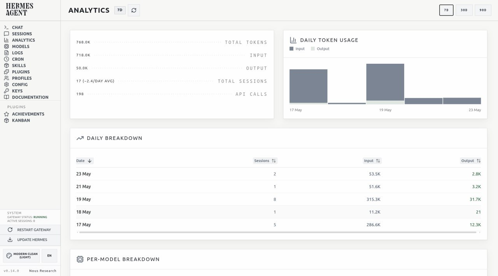
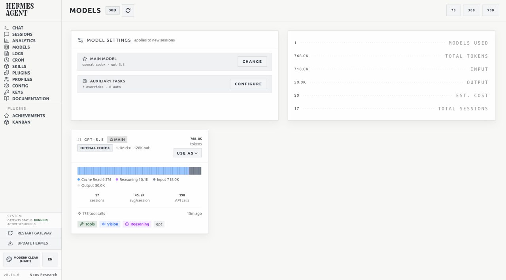
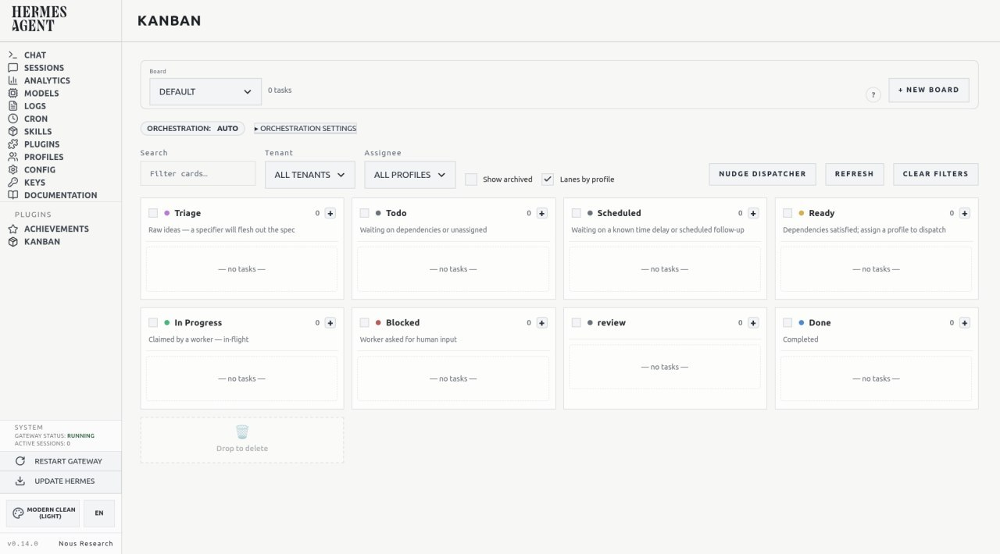
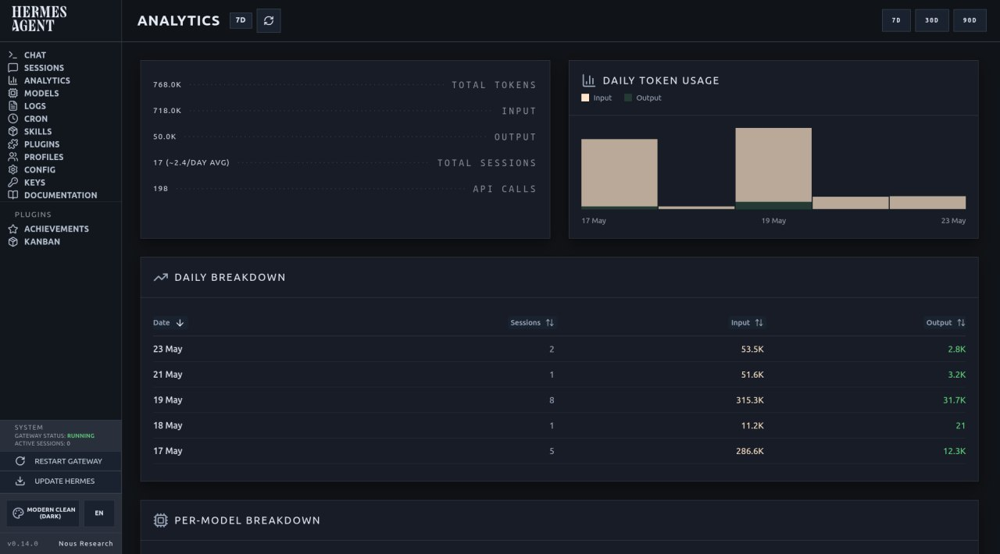
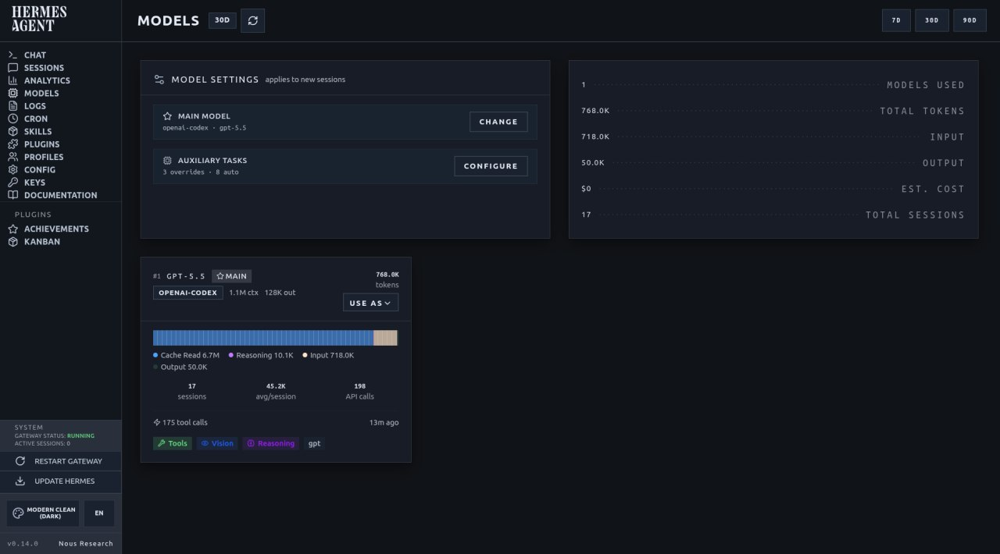
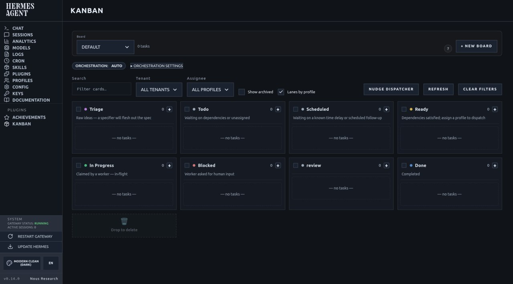

# Modern Clean Theme

Modern Clean Theme for Hermes Agent Dashboard.

## Installation

For normal use, copy only the generated theme YAML files. You do **not** need to copy this repository, the `themes/` source files, scripts, notes, or workflow documents into a Hermes profile.

1. Download or copy these files from `dist/` or from the latest GitHub release assets:
   - `modern-clean-light.yaml`
   - `modern-clean-dark.yaml`
2. Place them in your Hermes Dashboard theme directory, for example:
   ```bash
   mkdir -p "$HOME/.hermes/dashboard-themes"
   cp modern-clean-light.yaml modern-clean-dark.yaml "$HOME/.hermes/dashboard-themes/"
   ```
3. Refresh the Hermes Dashboard and select **Modern Clean (Light)** or **Modern Clean (Dark)** from the theme switcher.

Agents installing the theme should stop after copying the `.yaml` files. The rest of this repository is the maintainer workflow for editing, validating, previewing, and releasing the themes.

## Screenshots

### Light







### Dark







## Structure

```text
shared/                  Shared Modern Clean tokens and reference CSS
themes/light/custom.css  Light-only CSS pipeline; exactly what Light ships
themes/dark/custom.css   Dark-only CSS pipeline; exactly what Dark ships
variants/                Source variant metadata and palette tokens
dist/                    Generated deployable Hermes Dashboard theme YAML
scripts/                 Build, validation, and deployment helpers
notes/                   Design decisions and workflow notes
screenshots/             Optional visual QA captures
```

## Current variants

- `variants/light.yaml` — Modern Clean Light metadata and tokens.
- `variants/dark.yaml` — Modern Clean Dark metadata and tokens.
- `themes/light/custom.css` — separated Light CSS source. No Dark derivation.
- `themes/dark/custom.css` — separated Dark CSS source. No Light-only fixes.
- `dist/modern-clean-light.yaml` — generated deployable Light theme.
- `dist/modern-clean-dark.yaml` — generated deployable Dark theme.

## Quick start

```bash
python3 -m pip install -r requirements.txt
python3 scripts/build.py
python3 scripts/validate.py
```

## Intended workflow

1. Edit source files in this repo.
2. Run `python3 scripts/build.py`.
3. Run `python3 scripts/validate.py`.
4. Confirm the generated `dist/` files contain the intended changes.
5. Deploy previews with `python3 scripts/deploy-preview.py --target-dir <dashboard-theme-dir>` when visual testing is needed.
6. Promote to the live target with `python3 scripts/deploy.py --target-dir <dashboard-theme-dir>` only after review.

You can also set the target once per shell:

```bash
export HERMES_DASHBOARD_THEME_DIR="$HOME/.hermes/dashboard-themes"
python3 scripts/deploy-preview.py --dry-run
```

For the full gated deployment process, see `notes/deployment-workflow.md`.

## CSS safety model

The Hermes Dashboard currently serves only the first 32 KiB of a theme's `customCSS`. Treat that as a hard operational constraint: each theme CSS source must fit within the cap before deployment.

Build model:

1. `shared/tokens.yaml` supplies shared tokens.
2. `variants/<name>.yaml` supplies theme metadata and palette/token differences.
3. `themes/<name>/custom.css` supplies the complete CSS for that theme only.
4. `dist/*.yaml` is generated from the variant metadata plus that theme's separated CSS.

Light and Dark no longer share a runtime chrome stack, and Dark is no longer derived from Light during build. This prevents Light-only fixes from bleeding into Dark and prevents one theme from depending on clipped CSS from the other.

Protected invariants currently include:

- Hermes Agent wordmark casing, size, font, and theme-specific colour mapping.
- Desktop sidebar width, collapse behaviour, and smooth collapse/expand animation.
- Theme switcher selected-label behaviour.
- Sidebar footer version/org no-wrap behaviour.
- Header/log controls casing.
- Page-header adjacent status readability.
- Button polarity by theme.
- Light Kanban yellow priority badge contrast, with Dark explicitly excluded.

`scripts/build.py` prints a per-theme size report. `scripts/validate.py` fails if either separated CSS source exceeds 32 KiB or if protected invariants are missing from the composed source/dist artifacts.

## Theme CSS workflow

Edit the theme that actually needs changing:

- Light-only fix: edit `themes/light/custom.css`.
- Dark-only fix: edit `themes/dark/custom.css`.
- Shared token change: edit `shared/tokens.yaml` or both theme CSS files deliberately.

Rule: do not reintroduce a shared runtime chrome monolith or derive Dark from Light in the build. The old shared CSS files may remain as reference material, but generated themes must come from the separated `themes/<name>/` pipeline.

Verification for any CSS change:

1. Run `python3 scripts/build.py` to regenerate dist files and print the per-theme CSS cap report.
2. Run `python3 scripts/validate.py` to check protected invariants, Light/Dark separation, and cap compliance.
3. Confirm the expected selector appears in the intended dist file(s), and Light-only fixes do not appear in Dark.
4. Use `python3 scripts/deploy-preview.py --target-dir <dashboard-theme-dir> --dry-run` before preview deployment.
5. Deploy from `dist/` only when ready; never hand-edit live dashboard theme files as the source of truth.
